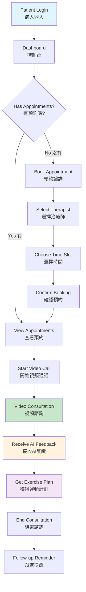
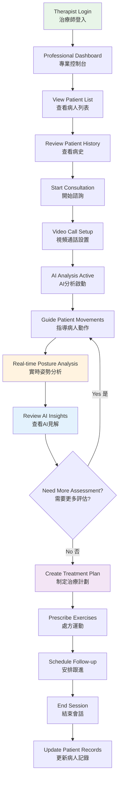
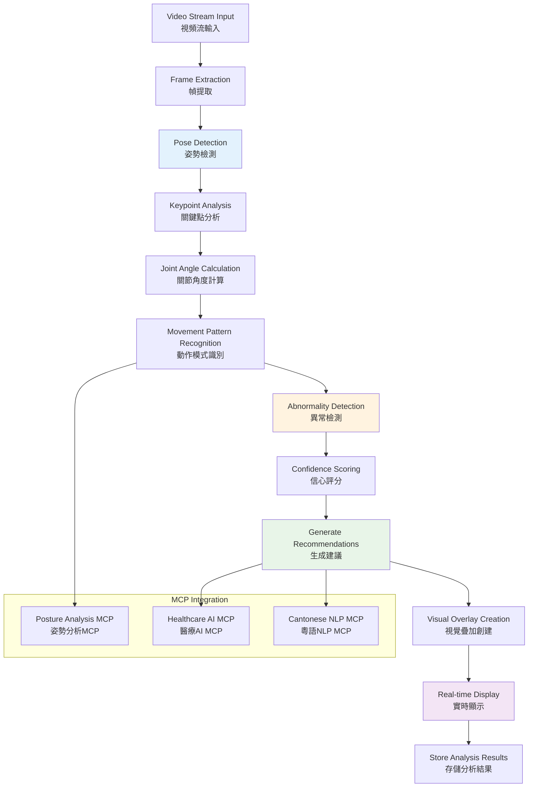
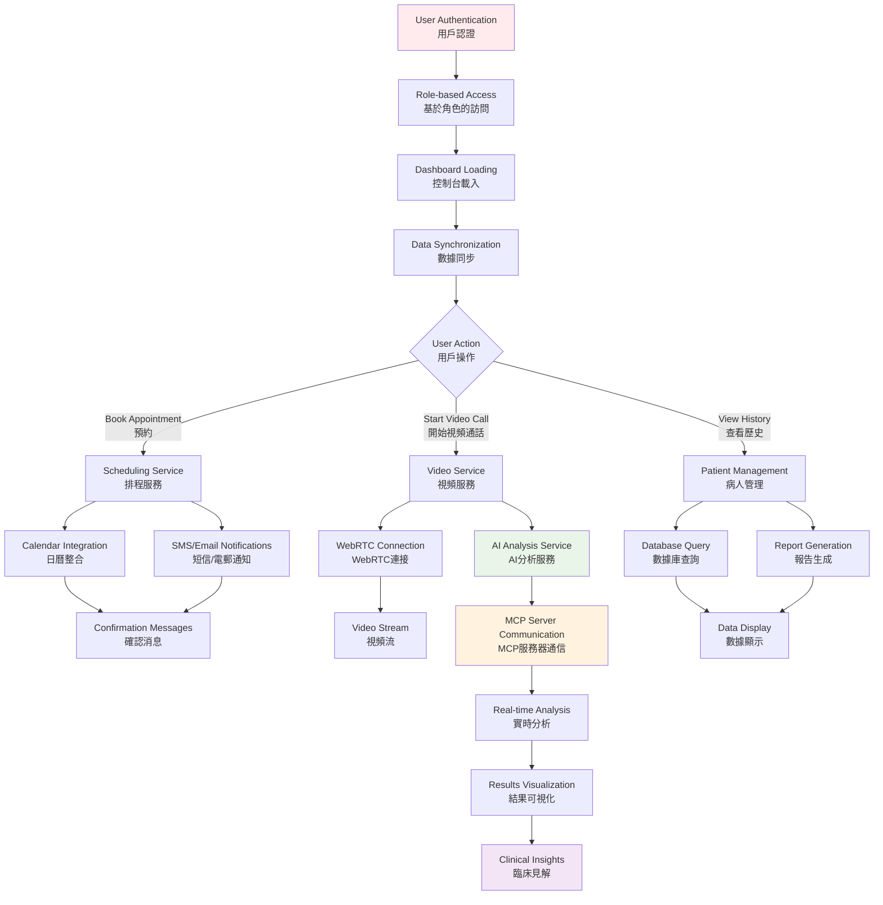
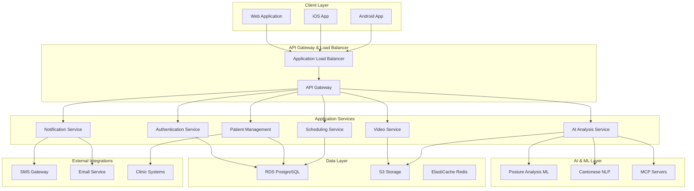
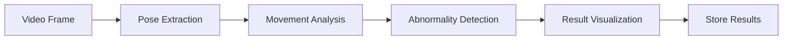

# Design Document

## Overview

The Virtual Physiotherapy Platform is a cloud-native telemedicine solution built on AWS infrastructure, designed to deliver remote physiotherapy consultations with AI-enhanced diagnostic capabilities. The platform combines real-time video communication, computer vision-based posture analysis, and comprehensive patient management in a culturally-appropriate Cantonese interface for Hong Kong users.

The system follows a microservices architecture deployed on AWS, leveraging serverless functions, managed databases, and AI/ML services. The platform integrates with MCP (Model Context Protocol) servers to provide extensible AI capabilities and third-party service integration.

## User Journey Flow

### Patient Journey (病人體驗流程)



### Therapist Journey (治療師體驗流程)



### AI Analysis Workflow (AI分析工作流程)



### System Integration Flow (系統整合流程)



## Architecture

### High-Level Architecture



### Technology Stack

**Frontend:**
- React.js with TypeScript for web application
- React Native for mobile applications (iOS/Android)
- Multi-language support using react-i18next (English, Traditional Chinese, Simplified Chinese)
- Locale-specific formatting with date-fns and Intl API
- WebRTC for real-time video communication

**Backend Services:**
- Node.js with Express.js for API services
- AWS Lambda for serverless functions
- AWS API Gateway for API management
- AWS Application Load Balancer for traffic distribution

**AI/ML Services:**
- AWS SageMaker for posture analysis models
- AWS Rekognition for computer vision
- Custom TensorFlow models for movement analysis
- MCP servers for extensible AI capabilities

**Data Storage:**
- AWS RDS PostgreSQL for relational data
- AWS S3 for video recordings and media files
- AWS ElastiCache Redis for session management and caching

**Infrastructure:**
- AWS ECS/Fargate for containerized services
- AWS CloudFront for content delivery
- AWS Route 53 for DNS management
- AWS CloudWatch for monitoring and logging

## Components and Interfaces

### 1. Authentication Service

**Purpose:** Manages user authentication, authorization, and session management with multi-factor authentication for healthcare providers.

**Key Features:**
- JWT-based authentication with refresh tokens
- Multi-factor authentication using SMS/TOTP
- Role-based access control (Patient, Physiotherapist, Admin)
- Integration with AWS Cognito for user management

**API Endpoints:**
```
POST /auth/login
POST /auth/logout
POST /auth/refresh
POST /auth/mfa/setup
POST /auth/mfa/verify
GET /auth/profile
```

### 2. Video Service

**Purpose:** Handles real-time video communication, recording, and streaming optimization.

**Key Features:**
- WebRTC signaling server for peer-to-peer connections
- TURN/STUN servers for NAT traversal
- Adaptive bitrate streaming based on network conditions
- Session recording with encrypted storage
- Real-time video quality monitoring

**WebRTC Integration:**
```javascript
interface VideoSession {
  sessionId: string;
  participants: Participant[];
  recordingEnabled: boolean;
  aiAnalysisEnabled: boolean;
  quality: VideoQuality;
}

interface Participant {
  userId: string;
  role: 'patient' | 'physiotherapist';
  connectionState: RTCPeerConnectionState;
  mediaStream: MediaStream;
}
```

### 3. AI Analysis Service

**Purpose:** Provides real-time posture analysis and movement assessment using computer vision and machine learning.

**Key Features:**
- Real-time pose estimation using MediaPipe/OpenPose
- Movement pattern analysis and range of motion calculation
- Abnormality detection and flagging
- Integration with MCP servers for extensible AI capabilities
- Results visualization with overlay graphics

**Analysis Pipeline:**


**API Interface:**
```typescript
interface PostureAnalysis {
  sessionId: string;
  timestamp: number;
  keyPoints: KeyPoint[];
  angles: JointAngle[];
  abnormalities: Abnormality[];
  confidence: number;
}

interface KeyPoint {
  name: string;
  x: number;
  y: number;
  confidence: number;
}
```

### 4. Patient Management Service

**Purpose:** Manages patient profiles, medical history, treatment plans, and progress tracking.

**Key Features:**
- Comprehensive patient profiles with medical history
- Treatment plan creation and management
- Progress tracking with visual charts
- Exercise prescription and compliance monitoring
- Integration with clinic management systems via HL7 FHIR

**Data Models:**
```typescript
interface Patient {
  id: string;
  personalInfo: PersonalInfo;
  medicalHistory: MedicalHistory[];
  treatmentPlans: TreatmentPlan[];
  consultations: Consultation[];
  exercises: ExercisePlan[];
}

interface TreatmentPlan {
  id: string;
  condition: string;
  goals: string[];
  exercises: Exercise[];
  duration: number;
  progress: ProgressMetric[];
}
```

### 5. Scheduling Service

**Purpose:** Handles appointment booking, calendar management, and automated reminders.

**Key Features:**
- Real-time availability checking
- Conflict prevention and resolution
- Automated reminder system (SMS/Email)
- Timezone handling for Hong Kong users
- Integration with physiotherapist calendars

**Scheduling Logic:**
```typescript
interface Appointment {
  id: string;
  patientId: string;
  physiotherapistId: string;
  scheduledTime: Date;
  duration: number;
  type: 'initial' | 'follow-up' | 'assessment';
  status: 'scheduled' | 'confirmed' | 'completed' | 'cancelled';
}
```

### 6. Notification Service

**Purpose:** Manages multi-channel notifications in multiple languages for appointments, reminders, and system updates.

**Key Features:**
- SMS notifications via AWS SNS with language-specific templates
- Email notifications with localized templates (English, Traditional Chinese, Simplified Chinese)
- In-app push notifications with i18n support
- Automated reminder scheduling with locale-appropriate timing
- Delivery status tracking and language preference management

### 7. Internationalization (i18n) Service

**Purpose:** Provides comprehensive multi-language support across the entire platform with cultural and regional adaptations.

**Key Features:**
- Language detection and selection (English, Traditional Chinese, Simplified Chinese)
- Dynamic content translation with medical terminology accuracy
- Locale-specific formatting for dates, times, numbers, and currency
- Cultural adaptation for Hong Kong, Taiwan, and Mainland China markets
- Real-time language switching without page reload
- Translation management and content versioning

**Supported Languages:**
```typescript
interface SupportedLocales {
  'en-US': 'English (United States)';
  'zh-HK': 'Traditional Chinese (Hong Kong)';
  'zh-TW': 'Traditional Chinese (Taiwan)';
  'zh-CN': 'Simplified Chinese (China)';
}

interface LocaleConfig {
  language: string;
  region: string;
  dateFormat: string;
  timeFormat: string;
  currency: string;
  medicalTerminology: 'traditional' | 'simplified' | 'western';
}
```

**Translation Structure:**
```json
{
  "common": {
    "login": "登入",
    "logout": "登出",
    "save": "儲存",
    "cancel": "取消"
  },
  "medical": {
    "physiotherapy": "物理治療",
    "consultation": "諮詢",
    "posture_analysis": "姿勢分析",
    "treatment_plan": "治療計劃"
  },
  "ui": {
    "dashboard": "控制台",
    "appointments": "預約",
    "video_call": "視頻通話",
    "ai_analysis": "AI分析"
  }
}
```

## Data Models

### Core Entities

**User Entity:**
```sql
CREATE TABLE users (
    id UUID PRIMARY KEY,
    email VARCHAR(255) UNIQUE NOT NULL,
    phone VARCHAR(20),
    role user_role NOT NULL,
    language_preference VARCHAR(10) DEFAULT 'zh-HK',
    created_at TIMESTAMP DEFAULT NOW(),
    updated_at TIMESTAMP DEFAULT NOW()
);
```

**Patient Profile:**
```sql
CREATE TABLE patients (
    id UUID PRIMARY KEY,
    user_id UUID REFERENCES users(id),
    name_chinese VARCHAR(100),
    name_english VARCHAR(100),
    date_of_birth DATE,
    gender gender_type,
    medical_conditions TEXT[],
    emergency_contact JSONB,
    insurance_info JSONB
);
```

**Consultation Session:**
```sql
CREATE TABLE consultations (
    id UUID PRIMARY KEY,
    patient_id UUID REFERENCES patients(id),
    physiotherapist_id UUID REFERENCES users(id),
    scheduled_time TIMESTAMP,
    actual_start_time TIMESTAMP,
    duration_minutes INTEGER,
    session_recording_url VARCHAR(500),
    ai_analysis_results JSONB,
    notes TEXT,
    status consultation_status
);
```

**AI Analysis Results:**
```sql
CREATE TABLE posture_analyses (
    id UUID PRIMARY KEY,
    consultation_id UUID REFERENCES consultations(id),
    timestamp TIMESTAMP,
    pose_data JSONB,
    movement_metrics JSONB,
    abnormalities JSONB,
    confidence_score DECIMAL(3,2)
);
```

## Error Handling

### Error Classification

**System Errors:**
- Network connectivity issues
- Service unavailability
- Database connection failures
- AI model inference errors

**User Errors:**
- Invalid input validation
- Authentication failures
- Authorization violations
- Scheduling conflicts

**Business Logic Errors:**
- Appointment booking violations
- Treatment plan conflicts
- Data consistency issues

### Error Response Format

```typescript
interface ErrorResponse {
  error: {
    code: string;
    message: string;
    messageCantonese: string;
    details?: any;
    timestamp: string;
    requestId: string;
  };
}
```

### Retry and Fallback Strategies

**Video Service:**
- Automatic reconnection with exponential backoff
- Quality degradation for poor network conditions
- Fallback to audio-only mode if video fails

**AI Analysis:**
- Retry failed analysis with reduced resolution
- Fallback to basic pose estimation if advanced models fail
- Queue analysis for offline processing if real-time fails

**Database Operations:**
- Connection pooling with automatic retry
- Read replica fallback for query operations
- Circuit breaker pattern for external integrations

## Testing Strategy

### Unit Testing
- Jest for JavaScript/TypeScript components
- 90% code coverage requirement
- Mock external dependencies (AWS services, MCP servers)
- Test Cantonese localization strings

### Integration Testing
- API endpoint testing with Postman/Newman
- Database integration tests with test containers
- WebRTC connection testing across different networks
- MCP server integration testing

### End-to-End Testing
- Cypress for web application flows
- Detox for mobile application testing
- Video call simulation and recording verification
- AI analysis accuracy validation with test datasets

### Performance Testing
- Load testing with Artillery.js
- Video streaming performance under various network conditions
- Database query optimization validation
- AI model inference latency testing

### Security Testing
- OWASP security scanning
- Penetration testing for healthcare compliance
- Encryption validation for video streams and data storage
- Authentication and authorization testing

### Accessibility Testing
- Screen reader compatibility for Cantonese content
- Mobile accessibility on iOS and Android
- Keyboard navigation support
- Color contrast validation

## Deployment and Infrastructure

### AWS Infrastructure

**Compute:**
- ECS Fargate for containerized microservices
- Lambda functions for event-driven processing
- Auto Scaling Groups for handling traffic spikes

**Storage:**
- RDS PostgreSQL with Multi-AZ deployment
- S3 with versioning and lifecycle policies
- ElastiCache Redis cluster for session management

**Networking:**
- VPC with public and private subnets
- Application Load Balancer with SSL termination
- CloudFront CDN for global content delivery

**Security:**
- AWS WAF for application protection
- AWS Shield for DDoS protection
- KMS for encryption key management
- IAM roles and policies for service access

### MCP Server Configuration

```json
{
  "mcpServers": {
    "aws-healthcare": {
      "command": "uvx",
      "args": ["aws-healthcare-mcp@latest"],
      "env": {
        "AWS_REGION": "ap-southeast-1",
        "HEALTHCARE_COMPLIANCE": "true"
      }
    },
    "cantonese-nlp": {
      "command": "uvx", 
      "args": ["cantonese-nlp-mcp@latest"],
      "env": {
        "LANGUAGE": "zh-HK",
        "MODEL_VERSION": "v2.1"
      }
    },
    "posture-analysis": {
      "command": "uvx",
      "args": ["posture-analysis-mcp@latest"],
      "env": {
        "MODEL_ENDPOINT": "https://api.posture-ai.com",
        "CONFIDENCE_THRESHOLD": "0.85"
      }
    }
  }
}
```

### Monitoring and Observability

**Application Monitoring:**
- CloudWatch for metrics and logs
- X-Ray for distributed tracing
- Custom dashboards for healthcare KPIs

**Performance Monitoring:**
- Video call quality metrics
- AI analysis latency tracking
- Database performance monitoring
- User experience analytics

**Alerting:**
- CloudWatch alarms for system health
- PagerDuty integration for critical issues
- Slack notifications for development team

This design provides a comprehensive, scalable, and secure foundation for the Virtual Physiotherapy Platform, addressing all requirements while leveraging modern cloud technologies and AI capabilities.