# Design Document

## Overview

The Virtual Physiotherapy Platform is a cloud-native telemedicine solution built on AWS infrastructure, designed to deliver remote physiotherapy consultations with AI-enhanced diagnostic capabilities. The platform combines real-time video communication, computer vision-based posture analysis, and comprehensive patient management in a culturally-appropriate Cantonese interface for Hong Kong users.

The system follows a microservices architecture deployed on AWS, leveraging serverless functions, managed databases, and AI/ML services. The platform integrates with MCP (Model Context Protocol) servers to provide extensible AI capabilities and third-party service integration.

## User Journey Flow

### Patient Journey (病人體驗流程)

```mermaid
graph TD
    A[Patient Login<br/>病人登入] --> B[Dashboard<br/>控制台]
    B --> C{Has Appointments?<br/>有預約嗎?}
    C -->|No 沒有| D[Book Appointment<br/>預約諮詢]
    C -->|Yes 有| E[View Appointments<br/>查看預約]
    D --> F[Select Therapist<br/>選擇治療師]
    F --> G[Choose Time Slot<br/>選擇時間]
    G --> H[Confirm Booking<br/>確認預約]
    H --> E
    E --> I[Start Video Call<br/>開始視頻通話]
    I --> J[Video Consultation<br/>視頻諮詢]
    J --> K[Receive AI Feedback<br/>接收AI反饋]
    K --> L[Get Exercise Plan<br/>獲得運動計劃]
    L --> M[End Consultation<br/>結束諮詢]
    M --> N[Follow-up Reminder<br/>跟進提醒]
    
    style A fill:#e1f5fe
    style J fill:#c8e6c9
    style K fill:#fff3e0
    style L fill:#f3e5f5
```



### Therapist Journey (治療師體驗流程)

```mermaid
graph TD
    A[Therapist Login<br/>治療師登入] --> B[Professional Dashboard<br/>專業控制台]
    B --> C[View Patient List<br/>查看病人列表]
    C --> D[Review Patient History<br/>查看病史]
    D --> E[Start Consultation<br/>開始諮詢]
    E --> F[Video Call Setup<br/>視頻通話設置]
    F --> G[AI Analysis Active<br/>AI分析啟動]
    G --> H[Guide Patient Movements<br/>指導病人動作]
    H --> I[Real-time Posture Analysis<br/>實時姿勢分析]
    I --> J[Review AI Insights<br/>查看AI見解]
    J --> K{Need More Assessment?<br/>需要更多評估?}
    K -->|Yes 是| H
    K -->|No 否| L[Create Treatment Plan<br/>制定治療計劃]
    L --> M[Prescribe Exercises<br/>處方運動]
    M --> N[Schedule Follow-up<br/>安排跟進]
    N --> O[End Session<br/>結束會話]
    O --> P[Update Patient Records<br/>更新病人記錄]
    
    style A fill:#e8f5e8
    style I fill:#fff3e0
    style J fill:#e3f2fd
    style L fill:#f3e5f5
```



### AI Analysis Workflow (AI分析工作流程)


### Session Management Flow (會話管理流程)

```mermaid
graph TD
    A[Join Consultation<br/>加入諮詢] --> B[Waiting Room<br/>等候室]
    B --> C[Device Testing<br/>設備測試]
    C --> D{Tests Passed?<br/>測試通過?}
    D -->|No 否| E[Fix Issues<br/>解決問題]
    E --> C
    D -->|Yes 是| F[Ready to Join<br/>準備加入]
    F --> G[Click to Start<br/>點擊開始]
    G --> H[Establishing Connection<br/>建立連接]
    H --> I[Video Session Active<br/>視頻會話啟動]
    I --> J[Real-time Monitoring<br/>實時監控]
    J --> K{Quality Issues?<br/>品質問題?}
    K -->|Yes 是| L[Auto Adjust Quality<br/>自動調整品質]
    L --> J
    K -->|No 否| M[Continue Session<br/>繼續會話]
    M --> N{Time Warning?<br/>時間警告?}
    N -->|25min| O[5min Warning<br/>5分鐘警告]
    N -->|28min| P[2min Warning<br/>2分鐘警告]
    N -->|29min| Q[1min Warning<br/>1分鐘警告]
    N -->|30min| R[Auto End Session<br/>自動結束會話]
    O --> M
    P --> M
    Q --> M
    R --> S[Session Summary<br/>會話摘要]
    M --> T{Manual End?<br/>手動結束?}
    T -->|Yes 是| S
    T -->|No 否| M
    S --> U[Cleanup & Records<br/>清理和記錄]
    
    style B fill:#e1f5fe
    style I fill:#c8e6c9
    style J fill:#fff3e0
    style S fill:#f3e5f5
```



### System Integration Flow (系統整合流程)


## Architecture

### High-Level Architecture


### Technology Stack

**Frontend:**
- React.js with TypeScript for web application
- React Native for mobile applications (iOS/Android)
- Multi-language support using react-i18next (English, Traditional Chinese, Simplified Chinese)
- Locale-specific formatting with date-fns and Intl API
- WebRTC for real-time video communication

**Backend Services:**
- Node.js with Express.js for API services
- AWS Lambda for serverless functions
- AWS API Gateway for API management
- AWS Application Load Balancer for traffic distribution

**AI/ML Services:**
- AWS SageMaker for posture analysis models
- AWS Rekognition for computer vision
- Custom TensorFlow models for movement analysis
- MCP servers for extensible AI capabilities

**Data Storage:**
- AWS RDS PostgreSQL for relational data
- AWS S3 for video recordings and media files
- AWS ElastiCache Redis for session management and caching

**Infrastructure:**
- AWS ECS/Fargate for containerized services
- AWS CloudFront for content delivery
- AWS Route 53 for DNS management
- AWS CloudWatch for monitoring and logging

## Components and Interfaces

### 1. Authentication Service

**Purpose:** Manages user authentication, authorization, and session management with multi-factor authentication for healthcare providers.

**Key Features:**
- JWT-based authentication with refresh tokens
- Multi-factor authentication using SMS/TOTP
- Role-based access control (Patient, Physiotherapist, Admin)
- Integration with AWS Cognito for user management

**API Endpoints:**
```
POST /auth/login
POST /auth/logout
POST /auth/refresh
POST /auth/mfa/setup
POST /auth/mfa/verify
GET /auth/profile
```

### 2. Video Service

**Purpose:** Handles real-time video communication, recording, and streaming optimization with comprehensive session management.

**Key Features:**
- WebRTC signaling server for peer-to-peer connections
- TURN/STUN servers for NAT traversal
- Adaptive bitrate streaming based on network conditions
- Session recording with encrypted storage and explicit consent management
- Real-time video quality monitoring with packet loss tracking
- Dual video stream management (main remote + picture-in-picture local)
- Advanced session controls (mute, camera toggle, screen sharing)
- Emergency contact integration for Hong Kong healthcare services
- Session time management with automatic warnings and termination
- Pre-session waiting room with camera/microphone testing capabilities

**WebRTC Integration:**
```javascript
interface VideoSession {
  sessionId: string;
  participants: Participant[];
  recordingEnabled: boolean;
  recordingConsent: ConsentRecord;
  aiAnalysisEnabled: boolean;
  quality: VideoQuality;
  sessionState: SessionManagementState;
  emergencyContacts: EmergencyContact[];
}

interface Participant {
  userId: string;
  role: 'patient' | 'physiotherapist';
  connectionState: RTCPeerConnectionState;
  mediaStream: MediaStream;
  localVideo: HTMLVideoElement;
  remoteVideo: HTMLVideoElement;
  cameraMode: 'front' | 'rear';
  mediaControls: MediaControls;
}

interface SessionManagementState {
  startTime: Date;
  duration: number;
  timeWarnings: TimeWarning[];
  connectionMetrics: ConnectionMetrics;
  qualityHistory: QualityMetric[];
  userInteractions: UserInteraction[];
}

interface MediaControls {
  isMuted: boolean;
  isCameraOn: boolean;
  isScreenSharing: boolean;
  audioQuality: 'excellent' | 'good' | 'fair' | 'poor';
  videoQuality: VideoQuality;
}

interface ConsentRecord {
  given: boolean;
  timestamp: Date;
  ipAddress: string;
  userAgent: string;
  consentText: string;
}
```

### 3. AI Analysis Service

**Purpose:** Provides real-time posture analysis and movement assessment using computer vision and machine learning.

**Key Features:**
- Real-time pose estimation using MediaPipe/OpenPose
- Movement pattern analysis and range of motion calculation
- Abnormality detection and flagging
- Integration with MCP servers for extensible AI capabilities
- Results visualization with overlay graphics

**Analysis Pipeline:**


**API Interface:**
```typescript
interface PostureAnalysis {
  sessionId: string;
  timestamp: number;
  keyPoints: KeyPoint[];
  angles: JointAngle[];
  abnormalities: Abnormality[];
  confidence: number;
}

interface KeyPoint {
  name: string;
  x: number;
  y: number;
  confidence: number;
}
```

### 4. Patient Management Service

**Purpose:** Manages patient profiles, medical history, treatment plans, and progress tracking.

**Key Features:**
- Comprehensive patient profiles with medical history
- Treatment plan creation and management
- Progress tracking with visual charts
- Exercise prescription and compliance monitoring
- Integration with clinic management systems via HL7 FHIR

**Data Models:**
```typescript
interface Patient {
  id: string;
  personalInfo: PersonalInfo;
  medicalHistory: MedicalHistory[];
  treatmentPlans: TreatmentPlan[];
  consultations: Consultation[];
  exercises: ExercisePlan[];
}

interface TreatmentPlan {
  id: string;
  condition: string;
  goals: string[];
  exercises: Exercise[];
  duration: number;
  progress: ProgressMetric[];
}
```

### 5. Scheduling Service

**Purpose:** Handles appointment booking, calendar management, and automated reminders.

**Key Features:**
- Real-time availability checking
- Conflict prevention and resolution
- Automated reminder system (SMS/Email)
- Timezone handling for Hong Kong users
- Integration with physiotherapist calendars

**Scheduling Logic:**
```typescript
interface Appointment {
  id: string;
  patientId: string;
  physiotherapistId: string;
  scheduledTime: Date;
  duration: number;
  type: 'initial' | 'follow-up' | 'assessment';
  status: 'scheduled' | 'confirmed' | 'completed' | 'cancelled';
}
```

### 6. Notification Service

**Purpose:** Manages multi-channel notifications in multiple languages for appointments, reminders, and system updates.

**Key Features:**
- SMS notifications via AWS SNS with language-specific templates
- Email notifications with localized templates (English, Traditional Chinese, Simplified Chinese)
- In-app push notifications with i18n support
- Automated reminder scheduling with locale-appropriate timing
- Delivery status tracking and language preference management

### 7. Advanced Session Management Service

**Purpose:** Provides comprehensive session control, monitoring, and user experience management for video consultations.

**Key Features:**
- Real-time connection status monitoring with visual indicators
- Video quality metrics display (resolution, frame rate, packet loss)
- Adaptive quality adjustment based on network conditions
- Session time tracking with automatic warnings (25, 28, 29 minutes)
- Recording consent management with patient privacy protection
- Emergency services integration (Hong Kong 999, medical hotlines)
- Pre-session waiting room with device testing capabilities
- Session analytics and quality reporting
- Accessibility support for keyboard navigation and screen readers

**Session States:**
```typescript
interface SessionState {
  phase: 'waiting' | 'connecting' | 'active' | 'ending' | 'ended';
  connectionStatus: 'connecting' | 'connected' | 'reconnecting' | 'disconnected';
  quality: 'excellent' | 'good' | 'fair' | 'poor';
  duration: number;
  participants: SessionParticipant[];
  recording: RecordingState;
  emergency: EmergencyState;
}

interface SessionParticipant {
  userId: string;
  role: 'patient' | 'therapist';
  connectionQuality: ConnectionMetrics;
  mediaState: MediaState;
  deviceCapabilities: DeviceCapabilities;
}

interface ConnectionMetrics {
  packetLoss: number;
  bitrate: number;
  latency: number;
  jitter: number;
}

interface RecordingState {
  isRecording: boolean;
  consentGiven: boolean;
  consentTimestamp: Date;
  recordingUrl?: string;
}
```

**Waiting Room Interface:**
```typescript
interface WaitingRoomState {
  cameraTest: DeviceTestResult;
  microphoneTest: DeviceTestResult;
  connectionTest: NetworkTestResult;
  participantReady: boolean;
  canJoinSession: boolean;
}

interface DeviceTestResult {
  available: boolean;
  working: boolean;
  permissions: 'granted' | 'denied' | 'prompt';
  errorMessage?: string;
}
```

**Emergency Integration:**
```typescript
interface EmergencyServices {
  hongKongEmergency: {
    number: '999';
    description: '香港緊急服務';
  };
  medicalHotline: {
    number: '2300 6555';
    description: '醫療緊急熱線';
  };
  hospitalDirectory: HospitalContact[];
}
```

### 8. Build Information Display Service

**Purpose:** Provides real-time build information display for development tracking and version identification.

**Key Features:**
- Automatic build number increment on code changes
- Git commit hash and branch tracking
- Build timestamp and type identification
- Header integration with responsive design
- Development vs production build differentiation
- Interactive build information tooltip

**Build Information Structure:**
```typescript
interface BuildInfo {
  buildNumber: number;
  version: string;
  lastBuild: string;
  gitCommit: string;
  gitBranch: string;
  buildType: 'development' | 'production';
}

interface BuildInfoDisplayProps {
  show: boolean;
  position: 'top-left' | 'top-right' | 'bottom-left' | 'bottom-right' | 'header';
}
```

**Display Features:**
- Header integration with subtle styling
- Hover effects for enhanced interactivity
- Color coding for build types (development: amber, production: green)
- Compact display with detailed tooltip
- Console logging for debugging purposes

### 9. Bilingual Language Toggle Service

**Purpose:** Provides real-time language switching between Traditional Chinese and English with persistent preference storage.

**Key Features:**
- Header-integrated language toggle button with flag icons
- Immediate interface updates without page reload
- Persistent language preference storage in localStorage
- Comprehensive translation dictionary for all UI elements
- Cultural adaptation for Hong Kong and international users
- Responsive design for mobile and desktop platforms

**Language Toggle Interface:**
```typescript
interface LanguageToggleProps {
  position: 'header' | 'standalone';
}

interface LanguageContextType {
  language: 'zh-HK' | 'en-US';
  setLanguage: (lang: Language) => void;
  t: (key: string) => string;
}

interface TranslationDictionary {
  'zh-HK': Record<string, string>;
  'en-US': Record<string, string>;
}
```

**Language Toggle Features:**
- Visual flag indicators (🇭🇰 for Traditional Chinese, 🇺🇸 for English)
- Smooth hover animations and transitions
- Tooltip showing next language option
- Compact header integration alongside build info
- Accessibility support for screen readers

**Translation Categories:**
- Header navigation and user controls
- Login and authentication interfaces
- Dashboard and appointment management
- Video consultation controls and status
- AI analysis results and recommendations
- Error messages and system notifications

### 10. Internationalization (i18n) Service

**Purpose:** Provides comprehensive multi-language support across the entire platform with cultural and regional adaptations.

**Key Features:**
- Language detection and selection (English, Traditional Chinese, Simplified Chinese)
- Dynamic content translation with medical terminology accuracy
- Locale-specific formatting for dates, times, numbers, and currency
- Cultural adaptation for Hong Kong, Taiwan, and Mainland China markets
- Real-time language switching without page reload
- Translation management and content versioning

**Supported Languages:**
```typescript
interface SupportedLocales {
  'en-US': 'English (United States)';
  'zh-HK': 'Traditional Chinese (Hong Kong)';
  'zh-TW': 'Traditional Chinese (Taiwan)';
  'zh-CN': 'Simplified Chinese (China)';
}

interface LocaleConfig {
  language: string;
  region: string;
  dateFormat: string;
  timeFormat: string;
  currency: string;
  medicalTerminology: 'traditional' | 'simplified' | 'western';
}
```

**Translation Structure:**
```json
{
  "common": {
    "login": "登入",
    "logout": "登出",
    "save": "儲存",
    "cancel": "取消"
  },
  "medical": {
    "physiotherapy": "物理治療",
    "consultation": "諮詢",
    "posture_analysis": "姿勢分析",
    "treatment_plan": "治療計劃"
  },
  "ui": {
    "dashboard": "控制台",
    "appointments": "預約",
    "video_call": "視頻通話",
    "ai_analysis": "AI分析"
  }
}
```

## Data Models

### Core Entities

**User Entity:**
```sql
CREATE TABLE users (
    id UUID PRIMARY KEY,
    email VARCHAR(255) UNIQUE NOT NULL,
    phone VARCHAR(20),
    role user_role NOT NULL,
    language_preference VARCHAR(10) DEFAULT 'zh-HK',
    created_at TIMESTAMP DEFAULT NOW(),
    updated_at TIMESTAMP DEFAULT NOW()
);
```

**Patient Profile:**
```sql
CREATE TABLE patients (
    id UUID PRIMARY KEY,
    user_id UUID REFERENCES users(id),
    name_chinese VARCHAR(100),
    name_english VARCHAR(100),
    date_of_birth DATE,
    gender gender_type,
    medical_conditions TEXT[],
    emergency_contact JSONB,
    insurance_info JSONB
);
```

**Consultation Session:**
```sql
CREATE TABLE consultations (
    id UUID PRIMARY KEY,
    patient_id UUID REFERENCES patients(id),
    physiotherapist_id UUID REFERENCES users(id),
    scheduled_time TIMESTAMP,
    actual_start_time TIMESTAMP,
    duration_minutes INTEGER,
    session_recording_url VARCHAR(500),
    ai_analysis_results JSONB,
    notes TEXT,
    status consultation_status
);
```

**AI Analysis Results:**
```sql
CREATE TABLE posture_analyses (
    id UUID PRIMARY KEY,
    consultation_id UUID REFERENCES consultations(id),
    timestamp TIMESTAMP,
    pose_data JSONB,
    movement_metrics JSONB,
    abnormalities JSONB,
    confidence_score DECIMAL(3,2)
);
```

## Error Handling

### Error Classification

**System Errors:**
- Network connectivity issues
- Service unavailability
- Database connection failures
- AI model inference errors

**User Errors:**
- Invalid input validation
- Authentication failures
- Authorization violations
- Scheduling conflicts

**Business Logic Errors:**
- Appointment booking violations
- Treatment plan conflicts
- Data consistency issues

### Error Response Format

```typescript
interface ErrorResponse {
  error: {
    code: string;
    message: string;
    messageCantonese: string;
    details?: any;
    timestamp: string;
    requestId: string;
  };
}
```

### Retry and Fallback Strategies

**Video Service:**
- Automatic reconnection with exponential backoff
- Quality degradation for poor network conditions
- Fallback to audio-only mode if video fails

**AI Analysis:**
- Retry failed analysis with reduced resolution
- Fallback to basic pose estimation if advanced models fail
- Queue analysis for offline processing if real-time fails

**Database Operations:**
- Connection pooling with automatic retry
- Read replica fallback for query operations
- Circuit breaker pattern for external integrations

## Testing Strategy

### Unit Testing
- Jest for JavaScript/TypeScript components
- 90% code coverage requirement
- Mock external dependencies (AWS services, MCP servers)
- Test Cantonese localization strings

### Integration Testing
- API endpoint testing with Postman/Newman
- Database integration tests with test containers
- WebRTC connection testing across different networks
- MCP server integration testing

### End-to-End Testing
- Cypress for web application flows
- Detox for mobile application testing
- Video call simulation and recording verification
- AI analysis accuracy validation with test datasets

### Performance Testing
- Load testing with Artillery.js
- Video streaming performance under various network conditions
- Database query optimization validation
- AI model inference latency testing

### Security Testing
- OWASP security scanning
- Penetration testing for healthcare compliance
- Encryption validation for video streams and data storage
- Authentication and authorization testing

### Accessibility Testing
- Screen reader compatibility for Cantonese content
- Mobile accessibility on iOS and Android
- Keyboard navigation support
- Color contrast validation

## Deployment and Infrastructure

### AWS Infrastructure

**Compute:**
- ECS Fargate for containerized microservices
- Lambda functions for event-driven processing
- Auto Scaling Groups for handling traffic spikes

**Storage:**
- RDS PostgreSQL with Multi-AZ deployment
- S3 with versioning and lifecycle policies
- ElastiCache Redis cluster for session management

**Networking:**
- VPC with public and private subnets
- Application Load Balancer with SSL termination
- CloudFront CDN for global content delivery

**Security:**
- AWS WAF for application protection
- AWS Shield for DDoS protection
- KMS for encryption key management
- IAM roles and policies for service access

### MCP Server Configuration

```json
{
  "mcpServers": {
    "aws-healthcare": {
      "command": "uvx",
      "args": ["aws-healthcare-mcp@latest"],
      "env": {
        "AWS_REGION": "ap-southeast-1",
        "HEALTHCARE_COMPLIANCE": "true"
      }
    },
    "cantonese-nlp": {
      "command": "uvx", 
      "args": ["cantonese-nlp-mcp@latest"],
      "env": {
        "LANGUAGE": "zh-HK",
        "MODEL_VERSION": "v2.1"
      }
    },
    "posture-analysis": {
      "command": "uvx",
      "args": ["posture-analysis-mcp@latest"],
      "env": {
        "MODEL_ENDPOINT": "https://api.posture-ai.com",
        "CONFIDENCE_THRESHOLD": "0.85"
      }
    }
  }
}
```

### Monitoring and Observability

**Application Monitoring:**
- CloudWatch for metrics and logs
- X-Ray for distributed tracing
- Custom dashboards for healthcare KPIs

**Performance Monitoring:**
- Video call quality metrics
- AI analysis latency tracking
- Database performance monitoring
- User experience analytics

**Alerting:**
- CloudWatch alarms for system health
- PagerDuty integration for critical issues
- Slack notifications for development team

This design provides a comprehensive, scalable, and secure foundation for the Virtual Physiotherapy Platform, addressing all requirements while leveraging modern cloud technologies and AI capabilities.